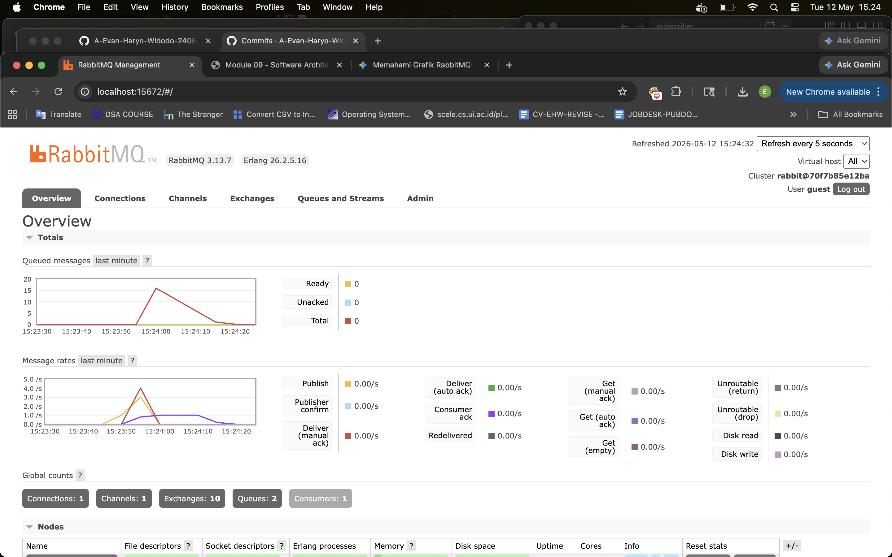
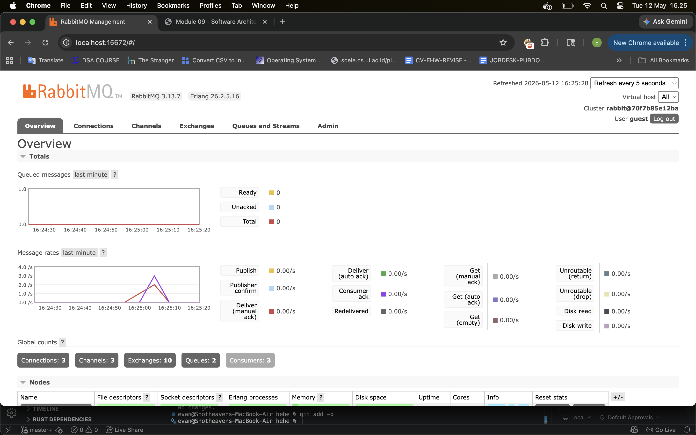

# Reflection
## What is amqp?
- AMQP (Advanced Message Queuing Protocol) adalah open standard application layer protocol yang dirancang sebagai communication protocol untuk mengirim pesan (message) antar service. AMQP memungkinkan sebuah aplikasi bertindak sebagai producer untuk mengirim pesan ke message broker, kemudian pesan tersebut diteruskan ke queue agar dapat diproses oleh aplikasi lain yang bertindak sebagai consumer. Mekanisme ini, umumnya diimplementasikan pada sistem berbasis microservices agar setiap service service tidak perlu saling terhubung secara langsung (loosely coupled architecture).

## What does guest:guest@localhost:5672 mean?
String tersebut adalah AMQP URI yang mendefinisikan string koneksi ke RabbitMQ message broker. "guest" pertama mendefinisikan username (default) dan "guest kedua" mendefinisikan passwordnya (default). Selanjutnya "localhost" adalah hostname yang menjelaskan RabbitMQ dijalankan di mana dan "5672" merupakan definisi port listener dari sistem RabbitMQ. Maka dari itu, "localhost:5672" memiliki arti bahwa RabbitMQ dijalankan di local machine di port 5672.

## Simulation slow subscriber

Adanya perlambatan dengan implementasi thread::sleep selama 1 detik memberikan dampak berupa pemrosesan pesan di subsciber hanya dapat berlangsung maksimum 1 pesan per detiknya. Alhasil, message queue saya melonjak menjadi 16 akibat dari ini. Angka 16 ini didapat dari 3 kali pengiriman pesan secara beruntun dari publisher.

## Running three subscribers

Berdasarkan percobaan saya dengan 1 publisher yang mengirim pesan sebanyak 3x secara beruntun dan adanya 3 subscriber yang berjalan bersamaan, saya melihat bahwa message queue dapat diproses jauh lebih cepat tanpa adanya penumpukan yang lama. Hal ini terjadi karena RabbitMQ mendistribusikan beban pesan secara merata kepada ketiga subscriber tersebut sejak awal. Maka dari itu, beban tidak hanya ditanggung oleh satu pihak, melainkan setiap subscriber menanggung beban yang sudah dibagi-bagi. Implementasi ini cukup mirip dengan kinerja load balancer yang melakukan distibusi request ke beberapa server berbeda untuk mencegah terjadinya bottleneck. Lalu, kenapa message setiap subscriber tidak menghasilkan 15 pesan? Hal ini karena pesan-pesan tersebut sudah terdistribusi ke setiap subscriber. Sebagai contoh, message queue mengirim 1 pesan ke subscriber A; selanjutnya, mengirim 1 pesan ke subscriber B, dan seterusnya sampai total pesan dalam queue habis.

Berdasarkan percobaan saya dengan 1 publisher yang mengirim pesan sebanyak 3x secara beruntun dan adanya 3 subscribers yang menerima pesan tersebut, saya melihat bahwa tidak ada pesan yang harus menunggu lagi. Hal ini, seakan-akan setiap pesan tdk terproses di satu subscriber, message queue langsung memberikan pesan yang tertahan ini ke subscriber lain (tanpa mempedulikan keberhasilan subscriber yang sleep itu memproses pesannya). Percobaan ini, seakan-akan implementasi load balancing sblm request diarahkan ke suatu server karena balancer akan mengarahkan ke server yang idle untuk memproses suatu request.

Selain itu, saya juga melihat adanya improvement kode yang dapat dilakukan pada sisi subscriber, yakni penambahan konfigurasi prefetch_count. Konfigurasi ini berfungsi untuk memberikan batas maksimal jumlah pesan yang boleh diproses oleh satu subscriber. Hal ini bertujuan untuk mendistribusikan pesan secara adil karena dengan membatasi prefetch count menjadi n, RabbitMQ tidak akan mendistribusikan beban secara frontal di awal, melainkan hanya akan memberikan pesan baru kepada subscriber yang benar-benar sedang idle. Hal ini memastikan beban pesan terdistribusi dengan jauh lebih optimal berdasarkan kapasitas kerja nyata dari masing-masing subscriber ketika dijalankan secara paralel.